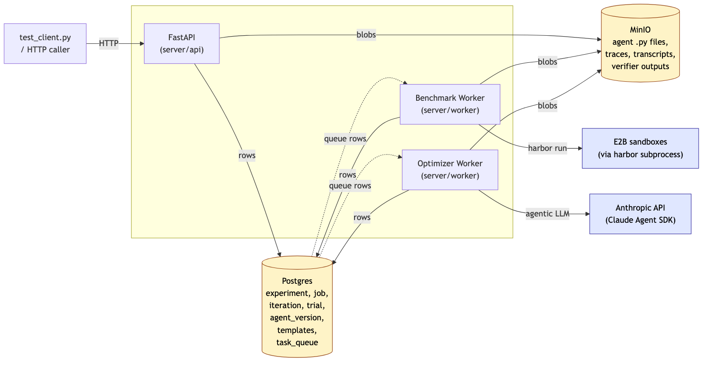
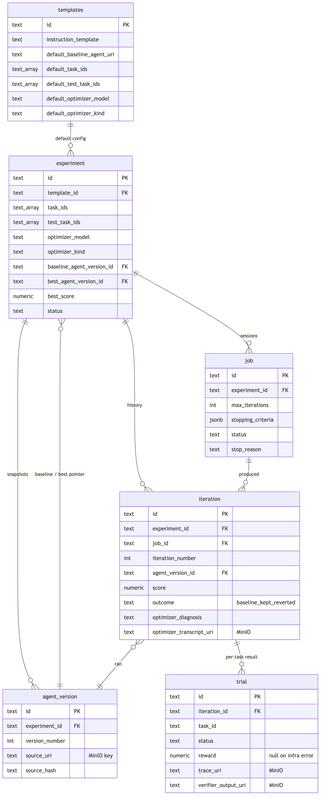
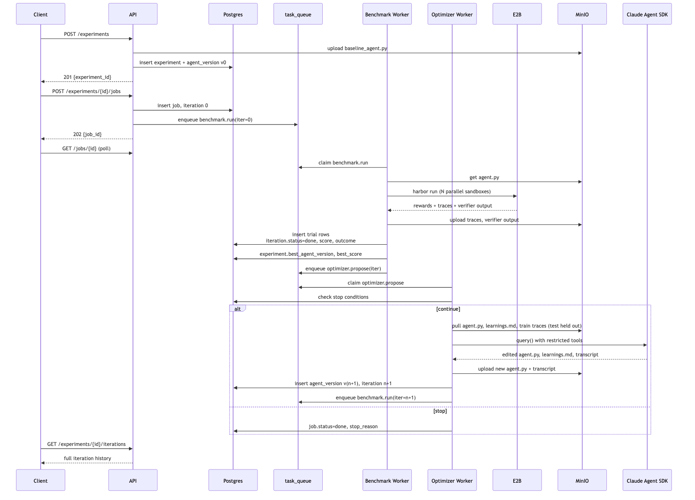

# Design — Agent Optimization Service

> Crisp, deliverable-grade design doc. Verbose rationale and decision history live in the working notes (`context/auto-harness-assignment/design.md`); this file is the version a reviewer reads.

---

## 1. Overview

A backend service that runs an inner coding agent (a Python file derived from `neosigmaai/auto-harness`) against TerminalBench tasks in E2B sandboxes, observes failures, invokes an outer LLM agent (Claude Agent SDK) to propose improvements to the inner agent's source, applies them, re-runs the benchmark, and persists the full iteration history. Two-process model (HTTP API + queue-driven worker), Postgres as system of record, MinIO for blobs, Anthropic + OpenAI + E2B as external services.

### 1.1 Architecture (HLD)



Source: [`docs/diagrams/architecture.mmd`](docs/diagrams/architecture.mmd)

- **API** is thin: validates, writes Postgres rows, uploads inline blobs to MinIO, enqueues queue tasks. No orchestration logic.
- **Workers** are short-lived consumers of `task_queue` rows. Two task types, two consumer pools, both stateless. The queue is the state machine; no long-running orchestrator.
- **External calls** are isolated to the worker: harbor + E2B for benchmarking, Claude Agent SDK for optimizing.

### 1.2 Glossary

| Term | Owner | Meaning |
|---|---|---|
| **task** | TerminalBench (upstream) | One benchmark problem (instruction + env + verifier). |
| **trial** | harbor (upstream) | One execution of an agent against one task → reward + trace. |
| **agent_version** | us | Snapshot of the inner agent's `.py` file at one point in an experiment's history. Stored as a Postgres row pointing to a MinIO object. |
| **benchmark run** | us | One pass of an `agent_version` across all `task_ids` → score + per-task results. |
| **iteration** | us + reference | One cycle: optimizer-proposal → benchmark → record. Iter 0 is the baseline (no optimizer call). Numbered monotonically per experiment. |
| **job** | us | One execution session of N iterations within an experiment. The unit a client submits and polls. |
| **experiment** | us | The long-lived container: baseline + immutable config + rolling best-agent state. Multiple jobs can run sequentially under one experiment. |

---

## 2. Data Model



Source: [`docs/diagrams/erd.mmd`](docs/diagrams/erd.mmd)

Seven tables. SQLModel + Alembic + asyncpg. Full DDL in `migrations/versions/*_initial_schema.py`.

### 2.1 What each table is for

| Table | Purpose | Notes |
|---|---|---|
| `templates` | Per-benchmark seed config (one row per benchmark, e.g. `terminal_bench`). Holds the outer-agent `INSTRUCTIONS.md` text + per-benchmark defaults. | Seeded by `seed/templates.py`. API never writes. |
| `experiment` | Long-lived container. Locked baseline + fixed task list + rolling `best_agent_version_id`/`best_score`. | `task_ids` and `test_task_ids` define train/test split. |
| `agent_version` | Pointer-row to a `.py` file in MinIO. One per iteration (incl. baseline). | The file IS the agent — system prompt, tools, loop logic, etc. |
| `job` | Session of N iterations. Status transitions `queued → running → done\|failed\|cancelled`. | Unique partial index ensures **at most one active job per experiment**. |
| `iteration` | Core record. Score, outcome (`baseline\|kept\|reverted`), pointers to optimizer artefacts. | Iteration 0 has null optimizer fields. |
| `trial` | One row per (iteration × task). Reward, wall time, command count, trace + verifier URIs. | `reward IS NULL AND status='infra_error'` ≠ `reward=0 AND status='done'`. |
| `task_queue` | The work queue. Two `task_type`s: `benchmark.run`, `optimizer.propose`. | Claimed via `SELECT … FOR UPDATE SKIP LOCKED`. |

### 2.2 Storage split

| Lives in **Postgres** | Lives in **MinIO** |
|---|---|
| All scalar fields (status, scores, IDs, FKs, timestamps, counts) | Agent `.py` files (`experiments/{id}/agents/v{n}.py`) |
| Short text (e.g. `optimizer_diagnosis` summary, `error_message`) | Per-trial message traces (`iterations/{n}/trials/{task}/trace.json`) |
| Stopping criteria JSONB | Per-trial verifier output (`iterations/{n}/trials/{task}/verifier.txt`) |
| Task arrays (`task_ids`, `test_task_ids`) | Optimizer's full agentic transcript (`iterations/{n}/optimizer/transcript.json`) |
| | Optimizer's input snapshot (the scratch dir contents at session start) |

Postgres rows carry `*_uri` columns pointing to MinIO objects. MinIO prefix `experiments/{exp_id}/` is the per-experiment "workspace."

---

## 3. Queue + Concurrency

### 3.1 Queue is the state machine

Two task types drive the entire optimization loop:

| Task type | Handler reads | Handler writes | Enqueues next |
|---|---|---|---|
| `benchmark.run` | iteration row → agent_version → MinIO `.py` | trial rows + traces/verifier in MinIO; updates iteration status, score, outcome; updates `experiment.best_*` | `optimizer.propose(same iter)` |
| `optimizer.propose` | iteration row → traces in MinIO (train only) → instruction template → checks stop conditions | new agent_version + iteration row; uploads new `.py`, learnings, transcript to MinIO | `benchmark.run(new iter)` *or* finalizes job (`done`/`stop_reason`) |

Workers claim with `SELECT … FOR UPDATE SKIP LOCKED LIMIT 1`. The claim, the work, and the next-task enqueue all happen in one DB transaction so partial state never leaks.

### 3.2 Concurrency knobs

- `WORKER_BENCHMARK_CONCURRENCY` (default 2) — parallel `benchmark.run` handlers per worker process.
- `WORKER_OPTIMIZER_CONCURRENCY` (default 2) — parallel `optimizer.propose` handlers per worker process.
- `experiment.max_concurrency` (default 5) — passed through to harbor as `-n` (parallel E2B sandboxes within one benchmark run).
- Multiple worker *processes* are safe (queue claim is row-locked); horizontal scale is just `python -m worker.main` × N.

### 3.3 The single hard invariant: one active job per experiment

Enforced by a Postgres partial unique index:

```sql
CREATE UNIQUE INDEX one_active_job_per_experiment
  ON job (experiment_id) WHERE status IN ('queued','running');
```

A second `POST /experiments/{id}/jobs` while one is active returns **409 Conflict**.

Within one job, iterations are inherently sequential — each depends on the prior's `best_agent_version`. Across experiments, full parallelism: different experiments share the queue but never the same row.

---

## 4. Sequence: One Job End-to-End



Source: [`docs/diagrams/sequence.mmd`](docs/diagrams/sequence.mmd)

Notable points:

- **Iteration 0 (baseline) has no optimizer call.** The first message enqueued by the API is `benchmark.run(0)` directly.
- **Stop conditions are checked at the top of every `optimizer.propose`** — `max_iterations`, `perfect_score (>=1.0)`, `stagnation` (N consecutive `reverted`), `wall_time`, `cancelled`. If any fires, the job is finalized and no further task is enqueued.
- **Train/test holdout** is enforced at scratch-dir population: traces for tasks listed in `experiment.test_task_ids` are deliberately not copied to the optimizer's scratch directory. The optimizer is told via `INSTRUCTIONS.md` that some traces will be missing by design.

---

## 5. Multi-experiment / Multi-job Scenarios

Small scenarios, no narrative — what the system actually does in each case.

### 5.1 Two clients submit jobs to *different* experiments simultaneously

Both `POST /jobs` succeed. Each writes its own `iteration 0` row + enqueues a `benchmark.run`. Both queue rows are visible to all workers; whichever worker claims first wins each row. Workers run them in parallel — different experiment IDs, different MinIO prefixes, no contention.

### 5.2 Client submits a second job to an experiment that has one running

`POST /jobs` raises `IntegrityError` from the partial unique index → translated to **409 Conflict** with `{"detail": "Experiment {id} already has an active job ..."}`. No row inserted.

### 5.3 Client submits a job, waits for it to finish, submits another job to the same experiment

First job runs through, ends `done`. Experiment's `best_agent_version_id` and `best_score` reflect whatever the optimizer reached. Second `POST /jobs` succeeds (no active job). The handler enqueues `optimizer.propose` against the **last `done` iteration** of the prior job — so iteration N+1's optimizer starts from the experiment's current best, exactly as if it were one continuous run.

### 5.4 Worker dies mid-iteration

The queue row is left in `running` status. Other workers won't claim it (it's not `pending`). After `WORKER_TASK_TIMEOUT_SECONDS` (30 min default), the sweeper resets stale-running rows back to `pending` — or to `dead_letter` if `attempts >= max_attempts (3)`. No business state is corrupted because each handler writes its work in one transaction; a half-done iteration's row was never committed, so the experiment state reflects only completed work.

### 5.5 Client cancels mid-job

`POST /jobs/{id}/cancel` flips `job.status = 'cancelled'`. **No interrupts** are sent to in-flight workers. The currently-running benchmark or optimizer call completes. The next worker that picks up a queued task for this job checks `job.status` first; if `cancelled`, it bails without doing the work and without enqueueing a successor. Worst case: one extra benchmark or optimizer call after cancel — bounded waste.

### 5.6 Optimizer agent fails (LLM error, malformed edit, timeout)

`OuterAgent.run()` returns `OuterAgentResult(status='error'|'timeout', error_message=...)`. The handler marks the new iteration row `failed`, sets `job.status='failed'` with `stop_reason='error'`. No further task is enqueued. The experiment's `best_agent_version_id` is unchanged (still pointing at the last-known-good iteration). A subsequent job on the same experiment resumes from there.

---

## 6. Failure Boundaries (summary)

| Class | Detection | Recorded as | Resumable? |
|---|---|---|---|
| Inner agent legitimately failed a task | harbor returns reward=0 with verifier output | `trial.status='done', reward=0` | n/a (legitimate signal) |
| E2B / harbor crashed | exception from `run_benchmark` | `trial.status='infra_error', reward=NULL, infra_error=...` | yes — next iteration retries cleanly |
| Worker crashed mid-task | row stuck in `running` past timeout | sweeper resets to `pending`, increments `attempts` | yes (up to `max_attempts=3`, then `dead_letter`) |
| Optimizer LLM error / timeout | `OuterAgentResult.status != 'ok'` | `iteration.status='failed', job.status='failed', stop_reason='error'` | yes (new job on same experiment) |
| Bad agent .py syntax | `ast.parse` smoke-check before benchmark | iteration `failed`, error_message populated, no benchmark cost paid | yes (next iteration overwrites) |

The discipline: distinguish "agent legitimately failed" (a *signal*) from "infrastructure crashed" (a *retry*). Reference repo's `prepare.py` conflated these (silently scored 0 on harbor errors); we deliberately don't.

---

## 7. Out of Scope (intentionally)

- **M5 multi-tenancy** — no `user`, `org`, or `role` tables; auth is uniform. Adding it is local: a middleware + a couple of `owner_user_id` / `org_id` columns + per-row scoping in queries. No core-architecture impact.
- **Idempotency keys** on `POST /jobs` — assumed clients retry rarely; deferred.
- **Mid-iteration interrupt on cancel** — passive cancel is sufficient for this scope.
- **Experiment branching** ("rewind to iteration N and fork") — the equivalent (clone with that snapshot as new baseline) is achievable through a new experiment.
- **Custom OuterAgent impls beyond `claude_agent_sdk`** — abstraction is in place (`OuterAgent` ABC + registry); plugging in `OpenAIAgentsSDKOuterAgent` or `SingleShotOuterAgent` is one new class.

---

## 8. Files-to-Code Map

For a reviewer reading the source:

| Concept in this doc | Code |
|---|---|
| Data model (§2) | `core/models.py`, `migrations/versions/*` |
| Storage split (§2.2) | `core/storage.py` (MinIO), `core/db.py` (Postgres) |
| Queue + claim (§3.1) | `core/queue.py` |
| API routes (§4) | `api/routes/{experiments,jobs,health,tasks}.py`, `api/schemas/*.py` |
| Benchmark handler | `worker/handlers/benchmark_run.py`, `core/benchmark_runner.py` |
| Optimizer handler | `worker/handlers/optimizer_propose.py` |
| OuterAgent ABC + impl | `worker/outer_agent/{base,claude_agent_sdk,registry}.py` |
| Worker loop | `worker/main.py` |
| Seeding | `seed/templates.py`, `seed/data/terminal_bench/*` |
| Test client | `test_client.py` |
| Smoke test | `scripts/smoke.sh` |
